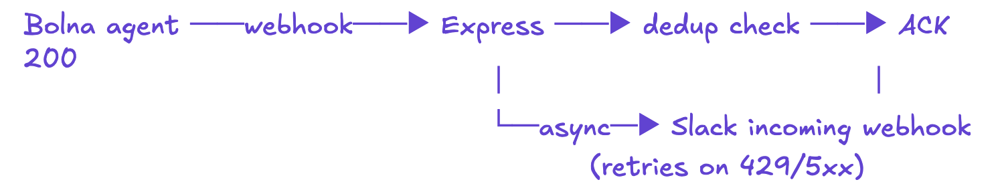
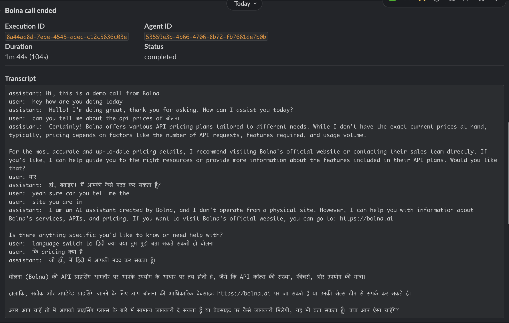

# Bolna to Slack alerts

When a Bolna voice agent finishes a call, this service posts a summary
to a Slack channel: the execution `id`, the `agent_id`, how long the
call ran, and the transcript. It's a single Express endpoint sitting
between Bolna's outbound webhook and a Slack incoming-webhook URL.

- Live: https://bolna-webhook-alert.onrender.com (webhook at
  `/webhook/bolna/<token>`, health at `/health`)
- Repo: https://github.com/1Mangesh1/bolna-webhook-alert



This is what the alert looks like in Slack from a real Bolna call:



## Design notes

Three things worth knowing if you're reviewing this:

1. **Bolna doesn't sign webhooks**, so auth is an IP allowlist
   (`13.203.39.153`, per
   [their docs](https://www.bolna.ai/docs/polling-call-status-webhooks))
   plus a path token. HMAC swap is one line if they add signing.
2. **Webhooks fire on every status change**, so dedup is mandatory.
   In-memory `Map<id, timestamp>` with a 1h TTL; multi-replica
   deployments need to swap that for Redis.
3. **Slack rate-limits under load**, so the handler ACKs Bolna with
   `200` first and posts to Slack asynchronously, with retries
   honouring `Retry-After`.

The deeper write-up of each tradeoff is further down.

## How it actually works

Bolna POSTs the full execution payload to whatever URL you configure
on the agent, and it does so on every status transition during the
call: `queued`, `in-progress`, `completed`, and so on. We only care
about the moment the call ends, so the handler ignores everything
that isn't a terminal status (`completed`, `call-disconnected`,
`busy`, `no-answer`, `failed`, `error`, `canceled`).

When a terminal event lands, we ACK Bolna with `200` immediately so
their webhook timeout never bites us, and then post to Slack in the
background. The Slack message is a Block Kit payload with a header,
a 2x2 grid of fields (id, agent, duration, status), and a code block
for the transcript.

Duration's a small puzzle. Bolna's normal calls populate
`conversation_time` (in seconds), but browser/demo calls sometimes
ship without it. The fallback chain is `conversation_time` →
`telephony_data.duration` → `(updated_at - created_at)`. Tested
against representative payloads from the dashboard.

## Running locally

```
npm install
cp .env.example .env
```

Edit `.env` and set:

- `SLACK_WEBHOOK_URL` — create one at https://api.slack.com/apps
  (Incoming Webhooks → add to workspace → copy the URL).
- `WEBHOOK_TOKEN` — anything long and random. The webhook URL becomes
  `/webhook/bolna/<token>`; without a matching token requests get
  rejected with `401`. Without setting `WEBHOOK_TOKEN` at all the
  endpoint is open, which is fine for local dev but obviously not
  what you want in production.
- `BOLNA_WEBHOOK_IPS` — optional, comma-separated. Bolna's
  [webhook docs](https://www.bolna.ai/docs/polling-call-status-webhooks)
  say all webhooks come from `13.203.39.153`. Set this in production
  and any request from another IP gets a `403`. Leave it unset for
  local dev so the smoke test on `127.0.0.1` still works. The list
  format means Bolna can add an IP and we update the env var without
  redeploying.
- `TRANSCRIPT_LIMIT` — optional, defaults to `2800`.
- `PORT` — defaults to `3000`.

Then:

```
npm start
```

You should see `live at http://localhost:3000/webhook/bolna` in the
console.

## Reviewing this

If you want to verify the integration without setting up a Bolna
account or a Slack workspace:

```
npm install
npm test          # 6 tests against a stub Slack server, no network
```

If you want it talking to a real Slack channel, fill in `.env` and:

```
npm start
npm run test:local  # POSTs test/mock-payload.json to the running server
```

`test/mock-payload.json` mirrors a real Bolna `completed` execution.
Within a second or two a "Bolna call ended" message lands in your
channel.

If you'd rather curl it yourself:

```
curl -X POST http://localhost:3000/webhook/bolna/$WEBHOOK_TOKEN \
  -H 'content-type: application/json' \
  -d @test/mock-payload.json
```

## Pointing Bolna at it

Inside the Bolna dashboard, open your agent, go to the Analytics tab,
and you'll see a section called "Push all execution data to webhook".
Paste your public URL there (path-token included) and save the agent.
For a quick demo without a real deployment, `ngrok http 3000` and use
the ngrok URL.

## Deploying it

Anywhere that runs Node 20 works. There's a `render.yaml` blueprint
in the repo for one-click Render deploys (Singapore region — closest
to Bolna's Mumbai egress IP). Once it's pushed:

1. Log in to the Render CLI: `render login`.
2. In the Render dashboard, **New → Blueprint Instance**, point it at
   this repo, accept the blueprint.
3. Render reads `render.yaml`, provisions the service, and prompts
   for the two `sync: false` secrets — `SLACK_WEBHOOK_URL` and
   `WEBHOOK_TOKEN`. Paste yours and deploy.
4. Use `render services` and `render logs` from the CLI to check
   status afterwards.
5. Update the Bolna agent's webhook URL to
   `https://<service>.onrender.com/webhook/bolna/<token>`.

For other platforms (Fly, Railway, Vercel, EC2): set the same env
vars in their dashboard, point at this repo, deploy. The GitHub
Actions workflow at `.github/workflows/test.yml` runs the test suite
on every push, which is enough CI hygiene for a service this size.

There's a tiny `GET /health` endpoint that returns `{"ok":true}`.
Render's free tier spins the service down after 15 minutes of
inactivity, which is bad for a webhook receiver — Bolna's POST would
cold-start the service and the request can time out. Pointing
UptimeRobot (or any similar uptime checker) at `/health` every 5
minutes keeps the service warm and gives you a free liveness check
on top.

## Auth, retries, dedup, and other tradeoffs

A few things were worth thinking through.

Webhook authentication. Bolna does not sign webhooks (verified
against their docs at
[/docs/polling-call-status-webhooks](https://www.bolna.ai/docs/polling-call-status-webhooks)).
Their published recommendation is IP whitelisting from
`13.203.39.153`. This service implements IP-based source
verification using `X-Forwarded-For` (with Express's `trust proxy`
enabled) since deployments behind a reverse proxy don't preserve
the original client IP on `req.socket.remoteAddress`. Allowed IPs
are read from `BOLNA_WEBHOOK_IPS` so we can add IPs without
redeploying. As a second layer, the webhook URL itself carries a
path token (`WEBHOOK_TOKEN`); requests without it get a `401`.

Limitations:

- IP rotation by Bolna will silently drop webhooks until the env
  var is updated. Mitigation: monitor the `403` rate from this
  endpoint.
- IP-based auth is weaker than HMAC. If Bolna adds signing later,
  swap the token check for a signature verifier — the call site
  in `server.js` is one line.

Idempotency. Bolna's docs don't promise once-only delivery, and a
single call can in theory ship two terminal events back-to-back — for
example a `call-disconnected` followed by `completed`. To guard
against that the handler keeps a `Map<id, timestamp>` with a 1-hour
TTL and quietly drops repeats. The TTL is swept on access so the map
can't grow without bound. The map is in-memory only; it resets on
restart. That's fine for this scope (no observed duplicates in
practice), but multi-replica deployments would need Redis or a small
DB table.

Slack delivery. The handler ACKs Bolna with `200` before it touches
Slack, and the post happens in the background. Slack returns `429`
under load and `5xx` occasionally; `postToSlack` retries up to twice
with linear backoff and honours `Retry-After` on rate limits. After
that it gives up and logs `slack_fail` with the status and body. For
an alerting service that's fine — losing a single notification is
annoying but recoverable. If you needed stricter delivery you'd
push the message onto a queue and have a worker drain it.

Graceful shutdown. On `SIGTERM` or `SIGINT` the server stops
accepting new connections and waits up to 5 seconds for in-flight
Slack posts to finish before exiting. Without that, a deploy mid-post
silently drops the alert.

Transcripts. Slack's `section` block caps at roughly 3000 characters.
Transcripts longer than that get truncated with a tail line noting
the full length and pointing back at Bolna's `GET /executions/{id}`
so a curious reader can pull the complete record. The cap itself is
configurable via `TRANSCRIPT_LIMIT`. Future v2: if long transcripts
become the common case, switch transport from incoming-webhook to a
bot token and attach the full transcript as a `.txt` file via
`files.uploadV2`. That's a real auth/scope upgrade (`files:write`,
bot installed in the channel), so it's not free — only worth it if
truncation is hurting day-to-day use.

## Not implemented (and why)

- **HMAC signature verification** — Bolna doesn't sign webhooks
  today. Verified against their docs. The auth code has the obvious
  swap-in point if/when they ship it.
- **Multi-replica dedup** — single-process `Map` is enough for this
  scope. Redis swap is documented; no point implementing it before
  there's a second replica to dedup against.
- **Long-transcript file uploads** — needs a bot-token transport and
  `files:write` scope. Documented as v2; gated on real demand.
- **Persistent call log / DB** — out of scope for the assignment.
  SQLite would be the next step if logs needed to outlive the
  process.

## Logs

Every log line is a single line of JSON, ready for any log aggregator:

```
{"t":"2026-04-29T10:15:58.355Z","event":"listening","port":3000}
{"t":"2026-04-29T10:16:02.110Z","event":"slack_ok","id":"4c06b...","ms":182}
{"t":"2026-04-29T10:16:09.901Z","event":"dedup","id":"4c06b..."}
```

Events you'll see: `listening`, `ignored` (non-terminal status),
`dedup`, `slack_ok` with latency, `slack_fail` with the error,
`shutdown` and `shutdown_done` around process exit.

## Files

- `server.js` — the whole service, around 180 lines.
- `test/server.test.js` — six tests using `node:test`, with a stub
  Slack server.
- `test/mock-payload.json` — a representative `completed` execution.
- `test/send-mock.js` — small helper that POSTs the mock through a
  running server.

Node 20 or later, because the code uses `--env-file=.env` and the
global `fetch`.
